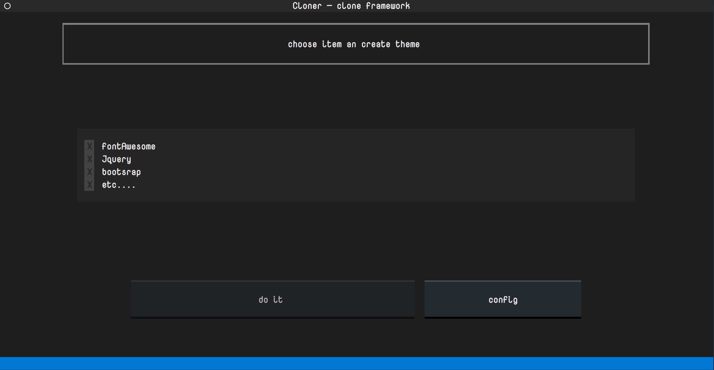

a TUI tool , This tool provides an easy access for copying files from the web or local sources into a local directory. Currently, this tool is in development, so if you find an issue, that is normal. Please report any issues you encounter. Thank you so much! Please see the data.json file for more configuration details; it is easy to read, which means you can understand it quickly without any problem. In the end, I would be happy if you could leave me feedback. This tool is under the MIT license.
