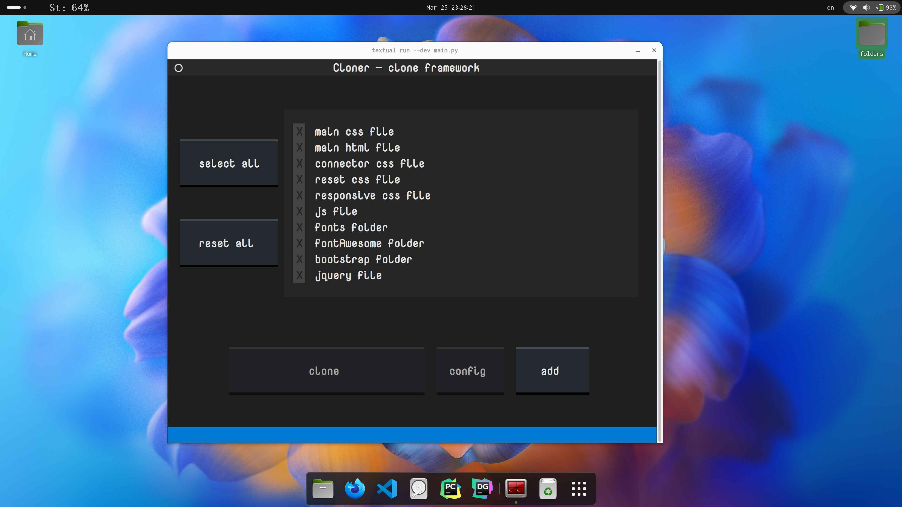

a TUI tool , This tool provides an easy access for copying files from the web or local sources into a local directory. Currently, this tool is in development, so if you find an issue, that is normal. Please report any issues you encounter. Thank you so much! Please see the data.json file for more configuration details; it is easy to read, which means you can understand it quickly without any problem. In the end, I would be happy if you could leave me feedback. This tool is under the MIT license.

# Cloner Tool

## Description
Cloner is a Python application designed to facilitate the cloning of files and directores. It provides a user-friendly interface for selecting predefined items, configuring them, and copying files or directories from specified sources to destinations. With Cloner, developers can efficiently manage framework configurations and streamline the process of replicating them.

## Features
- **Framework Selection:** Users can choose from a list of available framework configurations.
- **Configuration:** Users can configure selected framework items, including title, description, sources, and destination.
- **Copying Process:** Cloner facilitates the copying of files or directories from local sources or URLs to specified destinations based on configured framework settings.
- **Adding New Items:** Users can easily add new framework configurations by providing title, description, sources, and destination information.

## Installation
1. Clone the repository: `git clone https://github.com/lioil987/nct`
2. Navigate to the project directory: `cd nct`
3. Install dependencies: `pip install -r requirements.txt`

## Usage
1. Run the application: `python cloner.py`
2. The application interface will be displayed, allowing users to:
   - Select framework configurations.
   - Configure selected items.
   - Copy files or directories based on configurations.
   - Add new item(files or directores) configurations.
   # Please note that all configurations present within the application  don't work as expected. This is normal behavior, because the origin of the files is missing. These files are stored on my computer. You are welcome to add your own configurations. I lefted them for  to show how configuration is possible

## Configuration
- Framework configurations are stored in a JSON file (`data.json`). Users can modify this file directly or use the application interface to add, edit, or delete configurations.

## Dependencies
- Python 3.x
- textual
- requests

## Contributing
Contributions to Cloner are welcome! Feel free to submit bug reports, feature requests, or pull requests via GitHub.

## License
This project is licensed under the MIT License. See the `LICENSE` file for details.

## Authors
- mohammadReza soltanali

